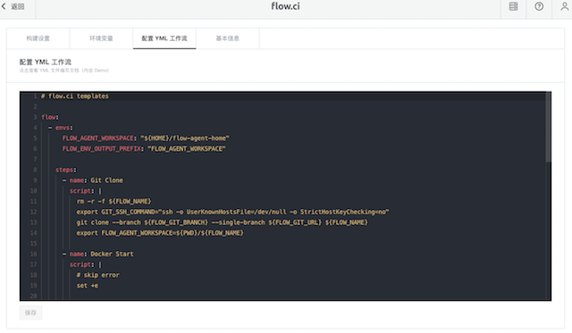
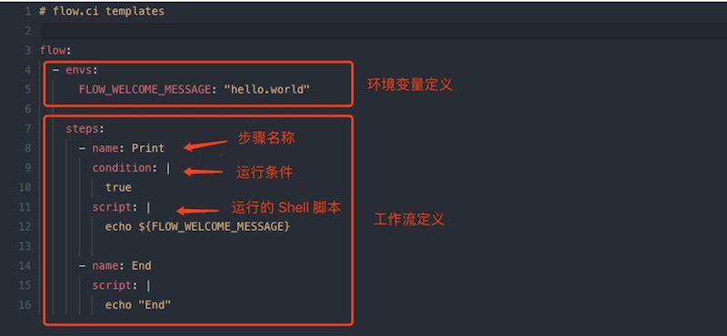

# YML 配置介绍

flow.ci 的工作流是通过 YML 配置文件来定义的，可以在创建 flow 时以及工作流配置中进行设置。如下图：

## YML 的格式
在 YML 中，可以分为环境变量和工作流定义。

- 环境变量定义 (非必须)：定义在工作流中使用的环境变量
- 工作流定义：
	- 步骤名称：1-100 个字符，支持空格
	- 运行条件 (非必须) ：可以根据需要，自定义 Groovy Script (可以调用自定义的环境变量)。该脚本运行时长不能超过 10 秒，需要返回值为布尔类型。
	- 运行的 Shell 脚本：Agent 实际执行的 Linux Bash Shell 脚本。

## 系统的环境变量

用户可以调用 flow.ci 系统的环境变量获取相关信息:

**工作流**

- `FLOW_NAME`: 当前工作流名称
- `FLOW_GIT_WEBHOOK`: 工作流 Git WebHook 的地址
- `FLOW_TASK_CRONTAB_CONTENT`: 定时任务 crontab 定义
- `FLOW_TASK_CRONTAB_BRANCH`: 定时任务的分支

**Git**

- `FLOW_GIT_URL`:  Git 仓库的 URL
- `FLOW_GIT_BRANCH`: 当前任务的分支
- `FLOW_GIT_CHANGELOG`: Git 提交的信息
- `FLOW_GIT_EVENT_TYPE`:  Git 的触发类型 `PUSH`, `PR`, `TAG`
- `FLOW_GIT_EVENT_SOURCE`: Git 触发来源 `GITALB`, `GITHUB`, `CODING`, `OSCHINA`, `BITBUCKET`
- `FLOW_GIT_COMMIT_ID`: 此次触发的 commit id
- `FLOW_GIT_COMMIT_URL`: 此次触发的 commit HTML 页面
- `FLOW_GIT_AUTHOR`: 此次触发的 Git 用户名
- `FLOW_GIT_AUTHOR_EMAIL`: 此次触发 Git 用户邮箱

**Job**

- `FLOW_JOB_BUILD_NUMBER`: 当前任务的构建编号
- `FLOW_JOB_BUILD_CATEGORY`:  当前任务的触发类型 `SCHEDULER`, `API`, `MANUAL`, `PUSH`, `PR`, `TAG`
- `FLOW_JOB_AGENT_INFO`: 当前任务所在的 Agent 名称
- `FLOW_JOB_LAST_STATUS`: 可以通过此环境变量获取上一步的构建结果 `SUCCESS`, `FAILURE`, `STOPPED`, `TIMEOUT`