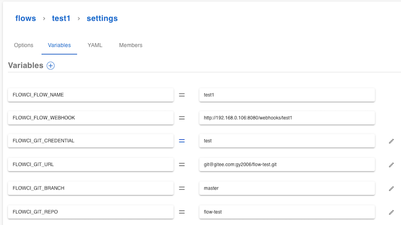

# 配置 Git

## 克隆 Git 仓库

flow.ci 通过 [git clone](https://github.com/flowci-plugins/gitclone) 插件来实现 clone 代码.

```yaml
steps:
- name: clone
  docker:
    image: flowci/debian-git ## 也可使用带有 git 命令的其他 image
  plugin: 'gitclone'
```

具体仓库地址，可以通过 YAML 或者 UI 界面的方式定义。如果 URL 为 SSH 协议，则需要创建 `secret`之后，设置 `FLOWCI_GIT_CREDENTIAL` 变量的值为 `secret` 的名称。

- YAML 配置

  ```yaml
  envs:
    FLOWCI_GIT_URL: "https://github.com/FlowCI/spring-petclinic-sample.git"
    # FLOWCI_GIT_CREDENTIAL: your_secret_name, created from secret from Admin Settings -> Secrets -> +
  ```

- UI 界面配置

  

## 配置 Git 仓库的访问权限，触发事件

不同 Git 仓库的访问权限，和触发事件的配置有略微差异，目前 flow.ci 支持的仓库有

- [GitHub](./github.md)
- [GitLab](./gitlab.md)
- [Gogs](./gogs.md)
- [Gitee](./gitee.md)

请点击相关 Git 仓库查看详细配置方法
